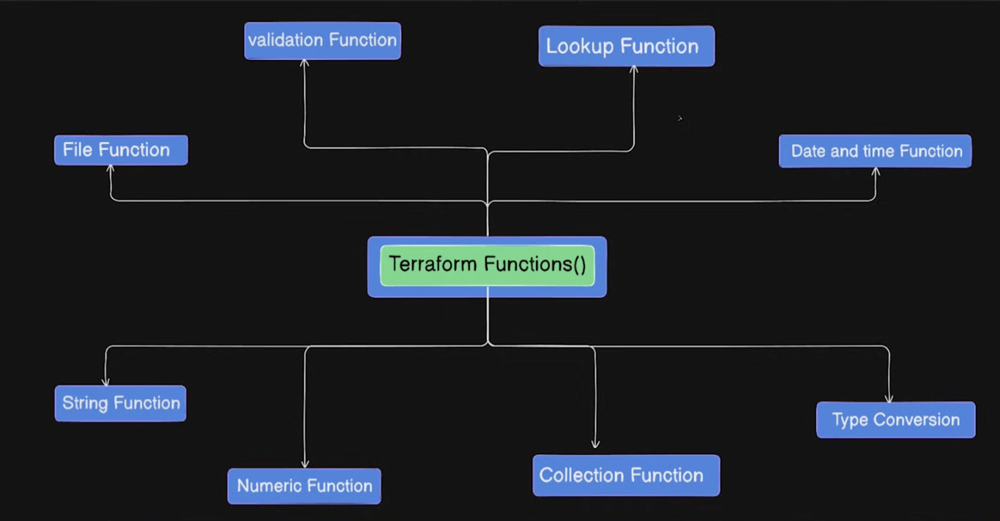

terraform console

lookup(map, key, [default_value])

validation function

String interpolation is a simple way to embed variables into a string, while the format function allows for precise technical formatting like padding, decimal control, and type conversion
