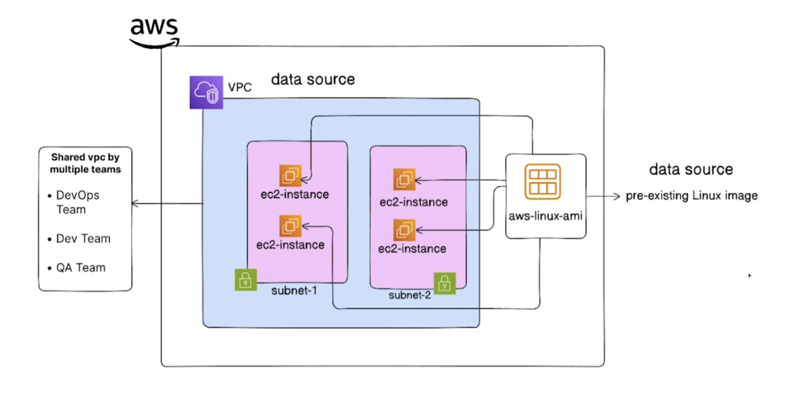
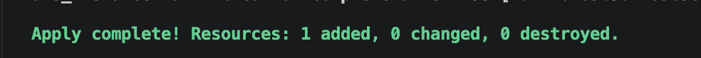

We have a "shared" VPC and subnet that were created by another team or process. Our task is to launch a new EC2 instance into this existing network infrastructure without managing the VPC or subnet with our Terraform configuration.

The following resources are assumed to exist in your AWS account:

VPC: with the tag Name = shared-network-vpc
Subnet: with the tag Name = shared-primary-subnet

