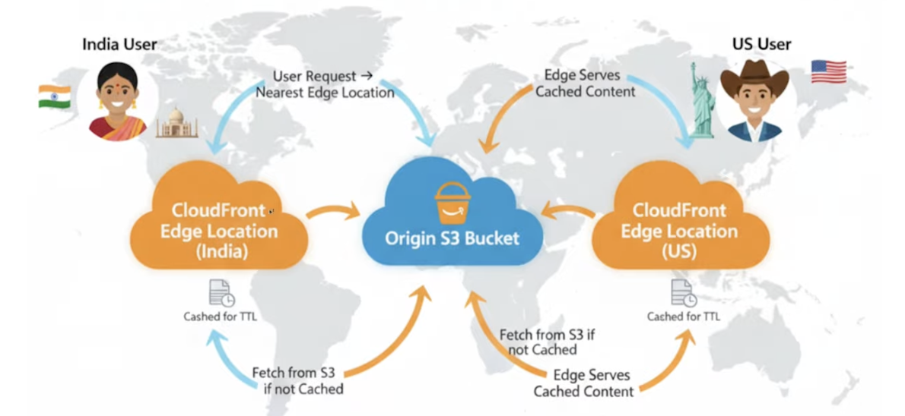
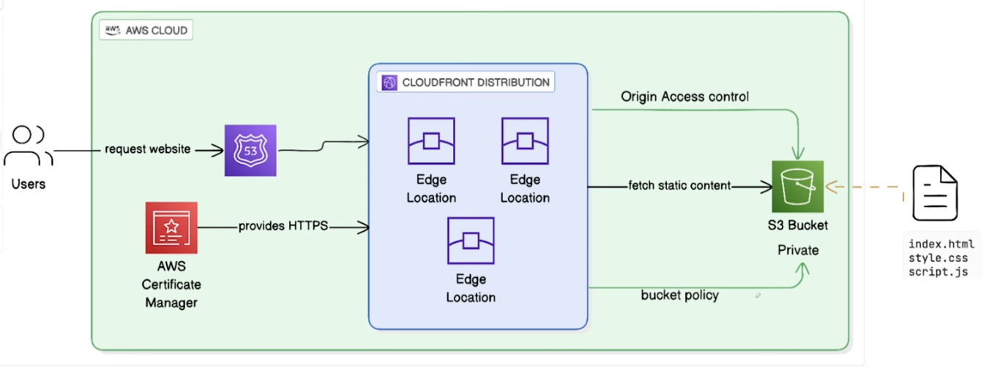

This mini project demonstrates how to deploy a static website on AWS using Terraform. 

Architecture
Internet → CloudFront Distribution → S3 Bucket (Static Website)

CLOUDFRONT:

Resource Diagram:

THINGS TO ADD LATER:
1. Custom domain name with route 53
2. SSL certificate with aws certificate manager
3. CI/CD pipeline for automatic deployments
4. multiple env (dev, stage, prod)
5. adv. cloudfront config (custom error pages, seuroty headers)
6. domain name has to be the same as bucket name
7. if we makeany changes ot the s3 the changes will not be reflected instantly because its stored in cache. cache has a default ttl. willl be available after ttl is over or cache invalidaiton
