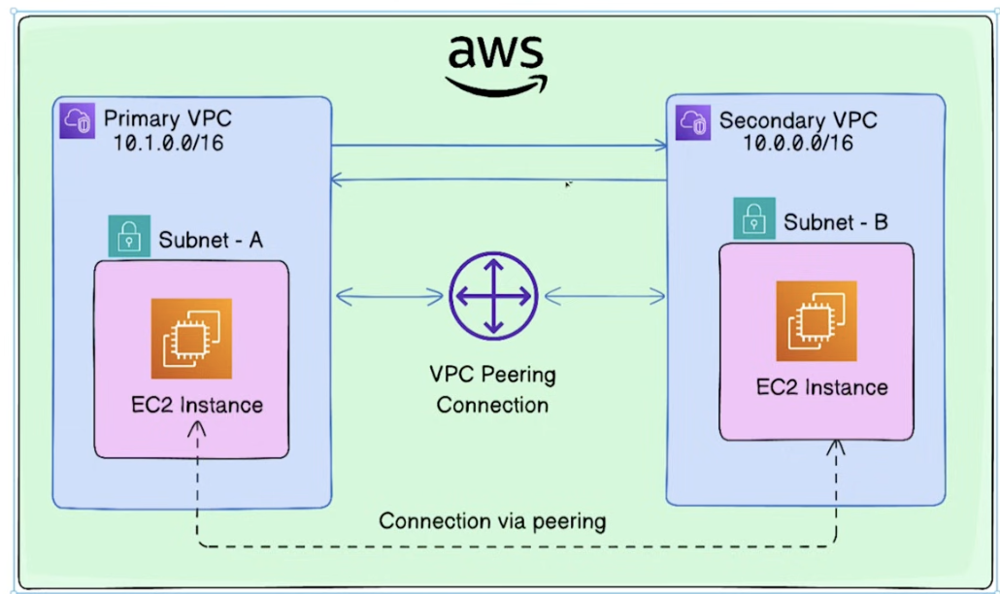
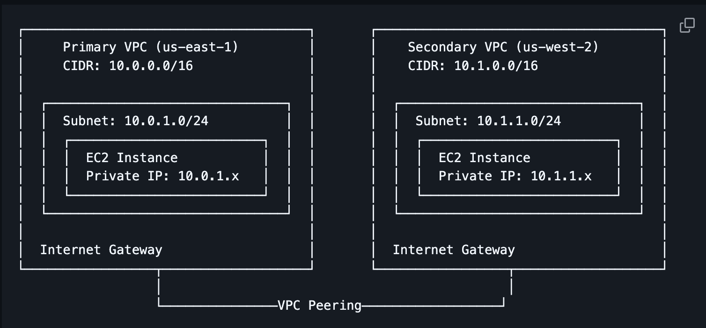
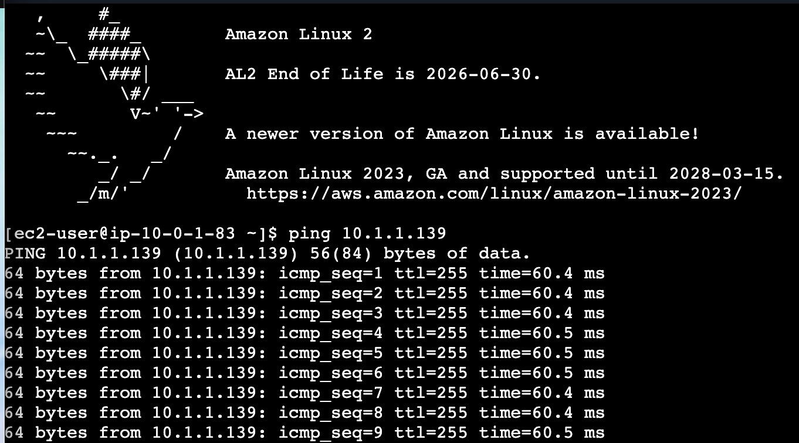

first we need to generate the access keys for the 2 ec2 instances and save them as .pem

then change the permissionsm to the keyfiles to 400

then we need to update the providers.tf file to include the access keys and secret keys for both regions. We also need to define the aliases for the providers so that we can reference them in our resources.

