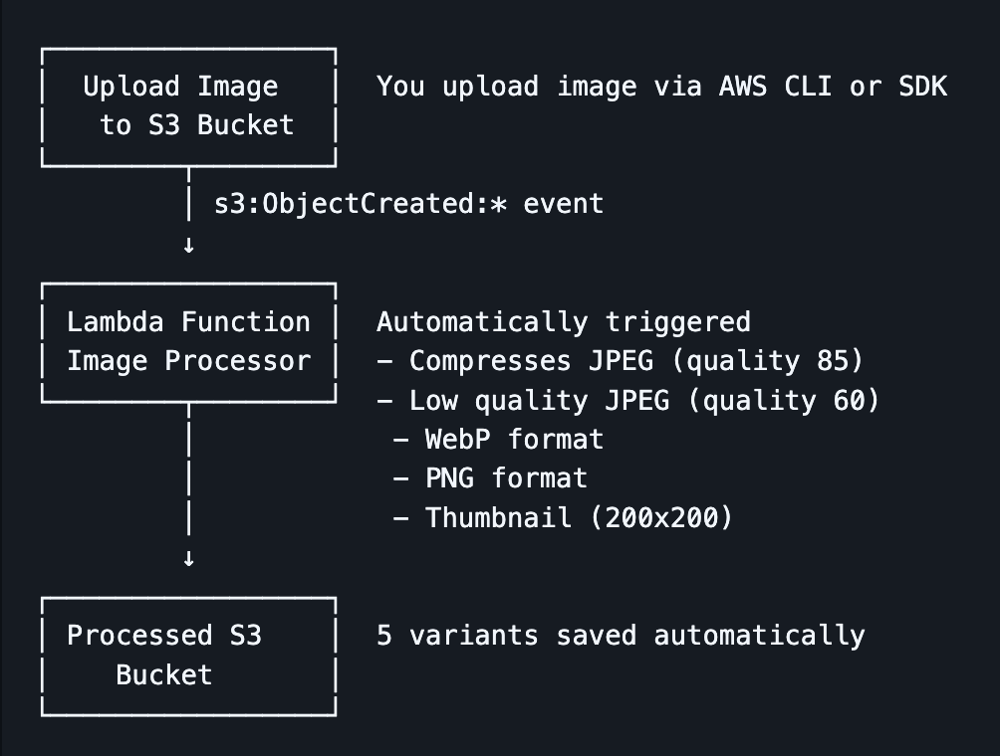
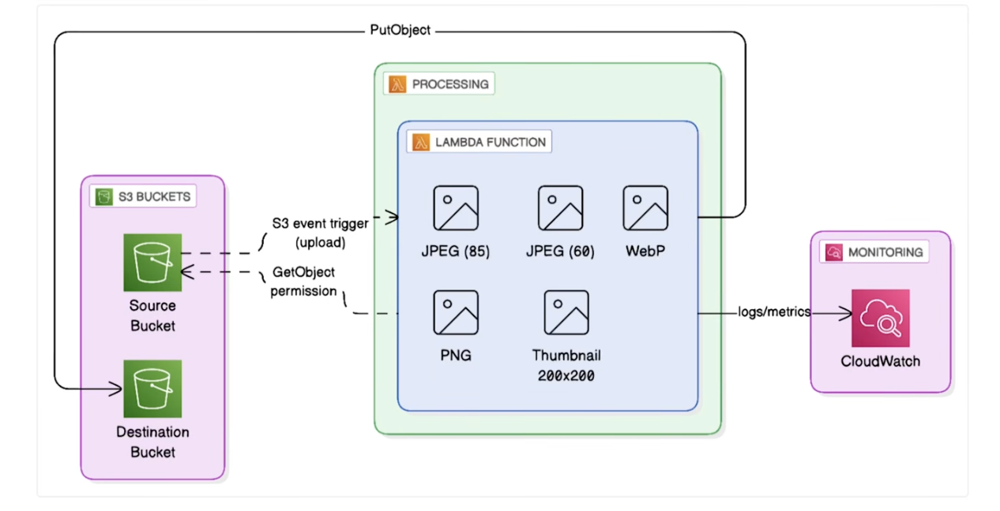

Simple Image Processor - Backend Only

A simplified serverless image processing pipeline that automatically processes images uploaded to S3.

📦 Components
Upload S3 Bucket: Source bucket for original images
Processed S3 Bucket: Destination bucket for processed variants
Lambda Function: Image processor with Pillow library
Lambda Layer: Pillow 10.4.0 for image manipulation
S3 Event Trigger: Automatically invokes Lambda on upload

🎨 Generated Variants
For each uploaded image, the Lambda function creates:

Compressed JPEG (85% quality) - Best balance of quality/size
Low Quality JPEG (60% quality) - Smallest file size
WebP Format (85% quality) - Modern format, better compression
PNG Format - Lossless, largest file size
Thumbnail (200x200) - Small preview image

🔐 Security Features
✅ All buckets are private (no public access)
✅ Server-side encryption (AES256)
✅ Bucket versioning enabled
✅ IAM least privilege (Lambda only has access to specific buckets)
✅ VPC isolation (optional, not configured by default)